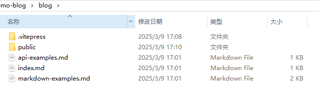
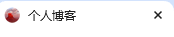
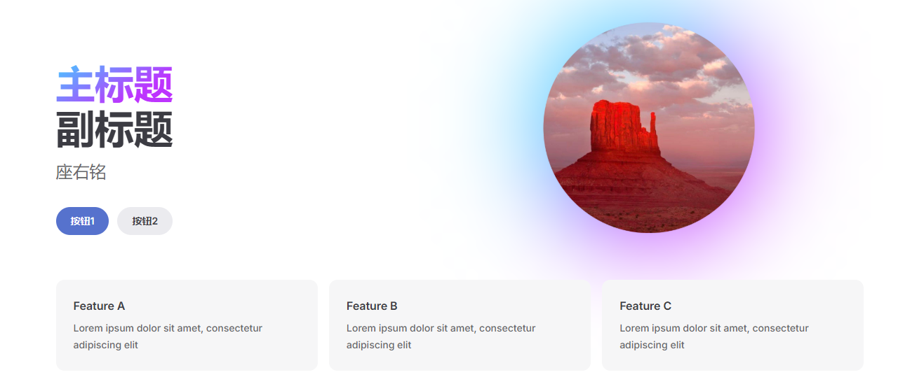
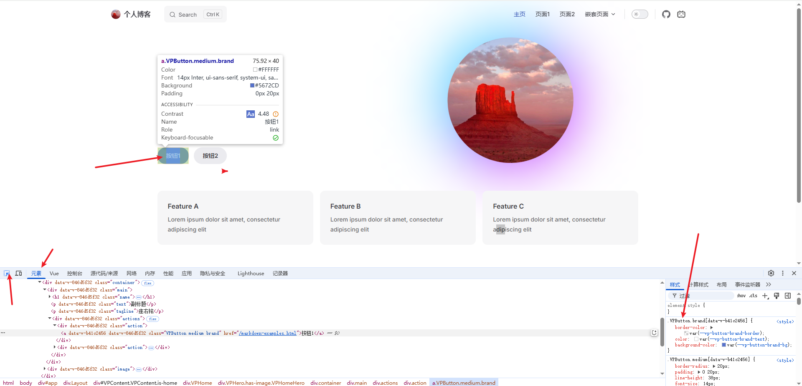

---
# 文档基本信息
title: 搭建博客
date: 2025-03-09-    # 创建日期
author: YuMeng    # 作者

# 分类和标签
category: 学习笔记  # 主分类
tags: 
  - 教程

# 文档描述
description: 手把手教你搭建一个属于你的博客

# 额外信息
sticky: 0        # 置顶顺序（0表示不置顶）
star: false           # 是否标星
---

# BuildBlog

手把手教你搭建一个属于你的博客，基于Vitepress搭建

## 基础模版

> [!IMPORTANT]
>
> 需要[Node.js](https://nodejs.org/zh-cn) 18 及以上版本。

**安装Vitepress**

```sh
npm add -D vitepress
```

**构建一个基本项目**

```sh
npx vitepress init
```

**回答几个简答的问题**

```
┌  Welcome to VitePress!	
│
◇  Where should VitePress initialize the config?	// 初始化位置
│  ./blog
│
◇  Site title:	// 标题
│  个人博客
│
◇  Site description:	// 描述
│  构建个人博客
│
◇  Theme:
│  Default Theme + Customization	// 默认主题 + 自定义
│
◇  Use TypeScript for config and theme files?	// 是否使用TypeScript
│  No
│
◇  Add VitePress npm scripts to package.json?
│  Yes
│
└  Done! Now run npm run docs:dev and start writing.
```

**启动**

```sh
npm run docs:dev
```

## 个性配置

### 顶部图标

在项目根目录创建一个`public`文件夹用于存放静态图片



其中放一张图片用于作为博客图标

例如文件名：`logo.png`

在`config.mjs`中添加⬇

```js (7-9,12)
import { defineConfig } from 'vitepress'

// https://vitepress.dev/reference/site-config
export default defineConfig({
    title: "个人博客",
    description: "构建个人博客",
    head: [
        ["link", { rel: "icon", href: "logo.png" }],
    ],
    themeConfig: {
        // https://vitepress.dev/reference/default-theme-config
        logo:'logo.png',
        nav: [
            { text: 'Home', link: '/' },
            { text: 'Examples', link: '/markdown-examples' }
        ],

        sidebar: [
            {
                text: 'Examples',
                items: [
                    { text: 'Markdown Examples', link: '/markdown-examples' },
                    { text: 'Runtime API Examples', link: '/api-examples' }
                ]
            }
        ],

        socialLinks: [
            { icon: 'github', link: 'https://github.com/vuejs/vitepress' }
        ]
    }
})

```

配置完成即可看到**顶部图标**，以及**左上角标题旁**边的图标



### 主页

#### 图片

在`index.md`文件中，添加以下配置：

```md (9-11)
---
# https://vitepress.dev/reference/default-theme-home-page
layout: home

hero:
  name: "主标题"
  text: "副标题"
  tagline: "座右铭"
  image:
    src: "logo.png"
    alt: "图片描述"
  actions:
    - theme: brand
      text: 按钮1
      link: /markdown-examples
    - theme: alt
      text: 按钮2
      link: /api-examples

features:
  - title: Feature A
    details: Lorem ipsum dolor sit amet, consectetur adipiscing elit
  - title: Feature B
    details: Lorem ipsum dolor sit amet, consectetur adipiscing elit
  - title: Feature C
    details: Lorem ipsum dolor sit amet, consectetur adipiscing elit
---
```



其他信息按需配置即可

按钮对应的路径跳转对应的**md文档**

#### features

底部的`features`甚至可以这样写：

```md
  - icon: 📷 
    title: 生活随笔 
    details: 记录日常感悟、阅读心得和生活中的美好瞬间。
    link: /index/life-notes
    linkText: 阅读随笔
```

- **icon** 图标（可以使用svg，甚至浅色和暗色模式使用不一样的svg）
- **title** 标题
- **details** 描述
- **link** 文档地址
- **linkText** 跳转提示

### 导航栏

在`config.mjs`中的`themeConfig`用于配置**顶部导航栏**

可多层嵌套

```js
    nav: [
      { text: '主页', link: '/' },
      { text: '页面1', link: '/markdown-examples' },
      { text: '页面2', link: '/markdown-examples' },
      {
        text: '嵌套页面', items: [
          { text: '嵌套1', link: '/markdown-examples' },
          { text: '嵌套2', link: '/markdown-examples' },
          { text: '嵌套3', link: '/markdown-examples' },

        ]
      }
    ],
```

### 侧边栏

```js
    sidebar: [
      {
        text: '侧边栏',
        items: [
          { text: '文档1', link: '/markdown-examples' },
          { text: '文档2', link: '/api-examples' }
        ]
      }
    ],
```

这样写的话配置的是全局侧边栏，所有页面的页面的侧边栏都是这些

我建议使用**路径匹配**，好处是自定义每个页面的侧边栏

```js
    sidebar: {
      '/': [
        {
          text: '侧边栏',
          items: [
            { text: '文档1', link: '/markdown-examples' },
            { text: '文档2', link: '/api-examples' }
          ]
        }
      ]
    },
```

### 其他配置

#### 图片懒加载

```js (5)
export default defineConfig({
    ...
    markdown: {
        image: {
            lazyLoading: true
        },
    }
    ...
}
```

#### 最后更新时间

开启**最后更新**时间提示：

**可自定义时间格式**

具体参考https://vitepress.dev/zh/reference/default-theme-config#lastupdated

```js (3,6-12)
export default defineConfig({
    ...
    lastUpdated: true,
    ...
    themeConfig:{
        lastUpdated: {
            text: '最后更新时间',
            formatOptions: {
                dateStyle: 'short',
                timeStyle: 'short'
            }
        },
    }
}
```

### 搜索框

```js (3-5)
themeConfig:{
    ...
    search: {
        provider: "local",
    },
     ...
}
```

还可以自定义**提示文本**

具体参考https://vitepress.dev/zh/reference/default-theme-search

### 社交链接

主页右上角的社交链接

可以使用自定义`svg`图标，添加对应地址

```js
themeConfig:{
    ...
        socialLinks: [
      { icon: 'github', link: 'https://github.com/yumengjianghu' },
      {
        icon: {
          svg: 'svg代码'
        },
        link: 'https://space.bilibili.com/...',
      }
    ],
    ...
}
```

### 页脚

```js
themeConfig:{
    ...
    footer: {
        copyright: '...',
            message: 'Copyright © ... 2024-2025 MIT',
    }
    ...
}
```

甚至在其中插入 **可点击链接**

```html
<a href="https://vitepress.dev/zh/" target="_blank">Vitepress</a>
```

## 高级玩法

### 自定义组件

可以自己写一些**Vue组件**插入文档

在`theme`文件夹中创建`components`文件夹，放入自定义组件

然后再`index.js`中引入组件，并且**全局注册组件**

```js
import Home from './components/home.vue' // 首页组件
...
export default {
...
  enhanceApp({ app, router, siteData }) { 
    app.component('Home', Home); // 注册首页组件
  }
}
```

如果只是单个页面使用组件

在那个**md**页面中使用`script`标签单独引入即可使用

```vue
<script setup>
import TimeLine from './.vitepress/theme/components/home.vue'
</script>
```

如果**每个页面都要使用同一个组件**，可以使用⬇，特点位置插入组件：
```js
  Layout: () => {
    return h(DefaultTheme.Layout, null, {
      'doc-before': () => h(组件), // 特点位置插入组件
      'doc-footer-before': () => h(组件), // 页面访问组件
    })
  },
```

具体配置https://vitepress.dev/zh/guide/extending-default-theme#layout-slots

- doc-footer-before 页脚上（最后更新时间上）
- doc-before 文档一级标题上
- doc-after 页面底部左下
- aside-top/bottom 侧栏顶/底部
- home-hero-before 主页左侧上
- home-hero-info-before 主页标题上
- home-hero-info 取代主页标题
- home-hero-info-after 副标题下
- home-hero-actions-after 按钮下
- home-hero-image 取代主页图片
- home-hero-after 主页左侧中

### 自定义样式

https://github.com/vuejs/vitepress/blob/main/src/client/theme-default/styles/vars.css

可以在`theme`文件夹下创建一个`Customize.css`文件夹，用于自定义样式，此样式会覆盖其原来的样式

> [!IMPORTANT]
>
> 要在`index.js`文件中引入

```js
import './style.css'
import './Customize.css'
```

**如何自定义样式**？

可以在浏览器中右键**检查**，或者直接按下`F12`或者`Ctrl + Shift + i`，



想要修改哪个元素获取对应的样式名即可

然后在`Customize.css`写入

> [!IMPORTANT]
>
> 复制样式名的时候**不要复制其ID**
>
> 比如`.VPButton.medium[data-v-b41c2456] {...}`，在自定义的时候就是`.VPButton.medium {}`
>
> 如果发现自定义样式无效，可以在样式后面加上`!important`试试

```css
.VPDoc {
  padding: 0px 32px 0 !important;
}
```

## 部署

...

<ReadingProgress/>

<Giscus/>
