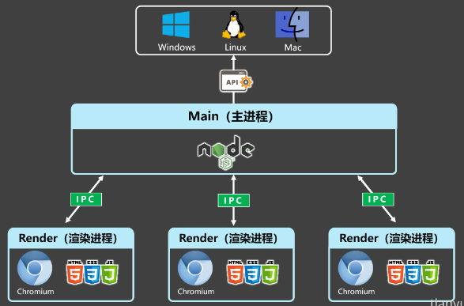
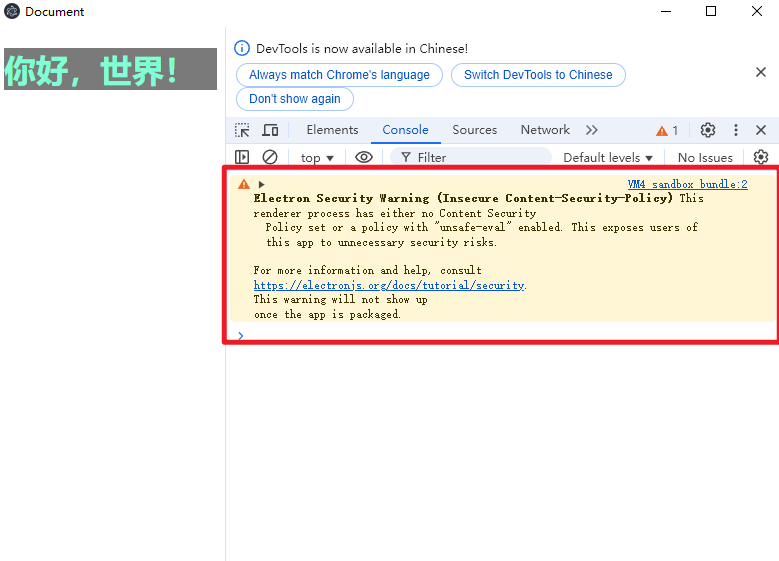
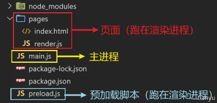

---
# 文档基本信息
title: Electron快速上手
date: 2025-02-18-    # 创建日期
author: YuMeng    # 作者

# 分类和标签
category: 技术文档  # 主分类
tags: 
  - Node.js
  - HTML
  - CSS
  - JavaScript
  - Electron

# 文档描述
description: 快速上手Electron核心知识

# 额外信息
sticky: 3        # 置顶顺序（0表示不置顶）
star: true           # 是否标星
---

# Electron快速上手

## 介绍

<span style="color:#0066CC;">Electron</span>是一个<span style="font-weight:bold; color:#990000;">跨平台桌面应用</span>开发框架，开发者可以使用：HTML、CSS、JavaScript 等 Web 技术来构建桌面应用程序，它的本质是结合了 <span style="font-weight:bold; color:#990000;">Chromium</span> 和 <span style="font-weight:bold; color:#990000;">Node.js</span>，现在广泛用于桌面应用程序开发

## 优势

1. **可跨平台**：同一套代码可以构建出能在：Windows、macOS、Linux 上运行的应用程序。
2. **上手容易**：使用 Web 技术就可以轻松完成开发桌面应用程序。
3. **底层权限**：允许应用程序访问文件系统、操作系统等底层功能，从而实现复杂的系统交互。
4. **社区支持**：拥有一个庞大且活跃的社区，开发者可以轻松找到文档、教程和开源库。

## 技术架构

###  技术架构


### 进程模型



其核心就是围绕**主进程**，就是一个node环境，用于管理**渲染进程**（窗口），渲染进程是浏览器环境了，即可使用前端三剑客了。

并且可以管理多个**渲染进程**，多线程应用。

主进程和渲染进程之间可以**通信**，**进程通信**简称IPC

主进程可以调用原生API，（Windows，Linux，Mac），不同平台使用同一套API

## 工程搭建

初始化一个包，并提填写好`package.json`中的必要信息及启动命令。

```json
{
  "name": "test",
  "version": "1.0.0",
  "main": "main.js",
  "scripts": {
    "start": "electron ." //start命令用于启动整个应用
  },
  "author": "YuMeng", //为后续能顺利打包，此处要写明作者。
  "license": "ISC",
  "description": "this is a electron demo", //为后续能顺利打包，此处要编写描述。
}
```

> [!important]
>
> 配置**短命令**的时候注意Electron后面有个**点**

安装`electron`作为开发依赖。

```bash
npm i electron -D
```

> -D 开发依赖

在`main.js`中编写代码，创建一个基本窗口

```js
/* 
  main.js运行在应用的主进程上，无法访问Web相关API，主要负责：控制生命周期、显示界面、控制渲染进程等其他操作。
*/
const { app, BrowserWindow } = require('electron')

// 用于创建窗口
function createWindow() {
  const win = new BrowserWindow({
    width: 800, // 窗口宽度
    height: 600, // 窗口高度
    autoHideMenuBar: true, // 自动隐藏菜单栏
    alwaysOnTop: true, // 置顶
    x: 0, // 窗口位置x坐标
    y: 0 // 窗口位置y坐标
  })
  // 加载一个远程页面
  win.loadURL('http://www.atguigu.com')
}

// 当app准备好后，执行createWindow创建窗口
app.on('ready',()=>{
  createWindow()
})
```

> 关于 BrowserWindow 的更多配置项，请参考：[BrowserWindow实例属性](https://www.electronjs.org/zh/docs/latest/api/base-window#实例属性)

启动应用查看效果

```bash
npm start
```

### 注意事项

在安装`electron`作为开发依赖的时候可能会报错

使用`cnmp`安装

安装cnpm

```bash
npm install -g cnpm --registry=https://registry.npmmirror.com
```

使用 cnpm 安装 electron

```bash
cnpm install electron -D
```

**启动问题**：

检查 Node.js 版本是否与 Electron 兼容

##  加载本地页面

创建一个`pages`文件夹，在其内部创建`index.html`

之后在主进程文件夹`main.js`，中使用以下代码加载本地文件

```js
win.loadFile('./pages/index.html')
```

> [!note]
>
> 其实窗口就是一个浏览器，其特点就是**开发者工具**，使用`Ctrl + Shift + i`，打开**控制台**，
>
> 可以通过配置**禁用**

### 细节


这个问题不影响开发，忽略即可



CSP配置，内容安全警告，网页能加载什么，不能加载什么

在MDN搜索CSP，在网页中配置meta标签

```html
<meta http-equiv="Content-Security-Policy" content="default-src 'self'; style-src 'self' 'unsafe-inline'; img-src 'self' data:;">
```

上述配置的说明

1. `default-src 'self'`

`default-src`：配置加载策略，适用于所有未在其它指令中明确指定的资源类型。

`self`：仅允许从同源的资源加载，禁止从不受信任的外部来源加载，提高安全性。

1. `style-src 'self' 'unsafe-inline'`

`style-src`：指定样式表（CSS）的加载策略。

`self`：仅允许从同源的资源加载，禁止从不受信任的外部来源加载，提高安全性。

`unsafe-inline`：允许在HTML文档内使用内联样式。

1. `img-src 'self' data:`

`img-src`：指定图像资源的加载策略。

`self`：表示仅允许从同源加载图像。

`data:`：允许使用 `data: URI` 来嵌入图像。这种URI模式允许将图像数据直接嵌入到HTML或CSS中，而不是通过外部链接引用。

**关于 CSP 的详细说明请参考：**[MDN-Content-Security-Policy](https://developer.mozilla.org/zh-CN/docs/Web/HTTP/Headers/Content-Security-Policy)、[Electron Security](https://www.electronjs.org/docs/latest/tutorial/security)

## 完善窗口行为

对应Windows和Mac电脑在处理一些东西是不一样的

- Windows：
  - 当所有的窗口都关闭，那么应用自动退出
- MacOS:
  - 应用就算退出了，在Dook栏里面还有这个应用

**Windows 和 Linux 平台窗口特点是：关闭所有窗口时退出应用。**

```js
// 当所有窗口都关闭时
app.on('window-all-closed', () => {
  // 如果所处平台不是mac(darwin)，则退出应用。
  if (process.platform !== 'darwin') app.quit()
})
```

**mac 应用即使在没有打开任何窗口的情况下也继续运行，并且在没有窗口可用的情况下激活应用时会打开新的窗口。**

```js
// 当app准备好后，执行createWindow创建窗口
app.on('ready',()=>{
  createWindow()
  // 当应用被激活时
  app.on('activate', () => {
    //如果当前应用没有窗口，则创建一个新的窗口
    if (BrowserWindow.getAllWindows().length === 0) createWindow()
  })
})
```

## 配置自动重启

安装 Nodemon

```bash
npm i nodemon -D
```

修改 package.json 命令

```json
"scripts": {
  "start": "nodemon --exec electron ."
},
```

**现在改完代码就会自动重启**

**但是改html文件不会自动刷新**

**创建**nodemon.json文件

**配置**nodemon.json规则，监视哪些文件

`"watch": ["*.*"],`监视所有文件

`"ext": "html,js,css"`包含文件

`"restartable": "r"`短命令

> [!tip]
>
> 当什么都没改的时候就想刷新，在控制台按下 `R`回车，即可自动重启

```json
{
  "ignore": [
    "node_modules",
    "dist"
  ],
  "restartable": "r",
  "watch": ["*.*"],
  "ext": "html,js,css"
}
```

配置好以后，当代码修改后，应用就会自动重启了。

## 主进程与渲染进程

下图是 Chrome 浏览器的程序架构，图来自于[Chrome 漫画](https://www.google.com/googlebooks/chrome/)。


Electron 应用的结构与上图非常相似，在 Electron 中主要控制两类进程：**主进程**、**渲染器进程**。

### 主进程

每个 Electron 应用都有一个单一的主进程，作为应用程序的入口点。 主进程在 Node.js 环境中运行，它具有 require 模块和使用所有 Node.js API 的能力，主进程的核心就是：<span style="font-weight:bold; color:#990000;">使用 BrowserWindow 来创建和管理窗口。</span>

### 渲染进程

每个 BrowserWindow 实例都对应一个单独的渲染器进程，运行在渲染器进程中的代码，必须遵守网页标准，这也就意味着：<span style="font-weight:bold; color:#990000;">渲染器进程无权直接访问 `require` 或使用任何 `Node.js`的API。</span>

> 问题产生：处于渲染器进程的用户界面，该怎样才与 **Node.js** 和 **Electron** 的原生桌面功能进行交互呢？

**主进程**和**渲染进程**通信需要使用**预加载脚本**（运行在渲染进程）

在根目录下创建预加载脚本 `preload.js`

## Preload 脚本

预加载（Preload）脚本是运行在渲染进程中的， 但它是在<span style="font-weight:bold; color:#990000;">网页内容加载之前</span>执行的，这意味着它具有比普通渲染器代码更高的权限，可以访问 Node.js 的 API，同时又可以与网页内容进行安全的交互。

简单说：它是 **Node.js** 和 **Web API** 的桥梁，Preload 脚本可以安全地将部分 **Node.js** 功能暴露给网页，从而减少安全风险。  

<span style="background:#3399FF; font-weight:bold; padding: 10px; border-radius: 10px; color:#000000;">需求：点击按钮后，在页面呈现当前的 Node 版本。</span>

<span style="font-weight:bold; font-size:1.5em;">执行顺序</span>

<span style="color:#990000;">主进程</span>  ->  <span style="color:#0080FF;">预加载脚本</span>  ->  <span style="color:#00FF00;">渲染进程</span>

预加载脚本是在渲染脚本执行的，但是也能使用一部分**node**的**API**

<span style="text-decoration:underline;">其中process.version就是那部分API</span>

在主进程中添加配置项：

**让主进程和预加载脚本关联**

```js
const path = require('path') 		// 引入

    webPreferences: {
      preload: path.resolve(__dirname, './preload.js')		// 添加到BrowserWindow配置对象
    },
```

**让预加载脚本和渲染进程关联**

```js
const { contextBridge } = require('electron');
```

`contextBridge.exposeInMainWorld`用于在暴露，即可在渲染进程看到

```js
// contextBridge.exposeInMainWorld('key',value);
contextBridge.exposeInMainWorld('qwe',{
    wer:100
})
```


具体文件结构与编码如下：

创建预加载脚本`preload.js`，

```js
const {contextBridge} = require('electron')

// 暴露数据给渲染进程
contextBridge.exposeInMainWorld('myAPI',{
  n:666,
  version:process.version
})
```

在主线程中引入preload.js

```js
const win = new BrowserWindow({
  /*******/
  webPreferences:{
    preload:path.resolve(__dirname,'./preload.js')
  }
  /*******/
})
```

在html中编写对应的按钮，并且创建专门编写网页脚本的`render.js`，随后引入

```html
<body>
  <h1>你好啊！</h1>
  <button id="btn">在用户的D盘创建一个hello.txt</button>
  <script type="text/javascript" src="./render.js"></script>
</body>
```

在渲染进程中使用`version`

```js
btn.addEventListener('click',()=>{
  console.log(myAPI.version)
  document.body.innerHTML += `<h2>${myAPI.version}</h2>`
})
```

整体文件结构



## 进程通信（IPC）

值得注意的是：

上文中的`preload.js`，无法使用全部`Node`的`API`，比如：不能使用`Node`中的`fs`模块，但主进程（`main.js`）是可以的，这时就需要**进程通信**了。简单说：要让`preload.js`通知`main.js`去调用`fs`模块去干活。

关于`Electron`进程通信，我们要知道：

- `IPC` 全称为：`InterProcess Communication`，即：进程通信。
- `IPC`是`Electron`中最为核心的内容，它是从`UI`调用原生`API`的唯一方法！
- `Electron`中，主要使用 [**ipcMain**](https://www.electronjs.org/zh/docs/latest/api/ipc-main) 和 [**ipcRenderer**](https://www.electronjs.org/zh/docs/latest/api/ipc-renderer) 来定义“通道”，进行进程通信。

### 渲染进程➡️主进程（单向）

概述：在<span style="color:#0066CC; font-weight:bold;">渲染器进程</span>中<span style="color:#0066CC; font-weight:bold;"> ipcRenderer.send</span> 发送消息，在<span style="font-weight:bold; color:#CC0000;">主进程</span>中使用<span style="font-weight:bold; color:#CC0000;"> ipcMain.on </span>接收消息。
常用于：<span style="font-weight:bold; color:#CC0000;">在 Web 中调用主进程的 API</span>，例如下面的这个需求：

<span style="background:#3399FF; font-weight:bold; padding: 10px; border-radius: 10px; color:#000000;">需求：点击按钮后，在用户的 D 盘创建一个hello.txt文件，文件内容来自于用户输入。</span>

页面中添加相关元素，`render.js`中添加对应脚本

**index.html**

```html
<input id="content" type="text"><br><br>
<button id="btn">在用户的D盘创建一个hello.txt</button>
```

**render.js**

```js
const btn = document.getElementById('btn')
const content = document.getElementById('content')

btn.addEventListener('click',()=>{
  console.log(content.value)
  myAPI.saveFile(content.value)
})
```

`preload.js`中使用<span style="font-weight:bold; color:#0080FF;">ipcRenderer.send('信道',参数)</span>发送消息，与主进程通信。

**preload.js**

```js
const {contextBridge,ipcRenderer} = require('electron')

contextBridge.exposeInMainWorld('myAPI',{
  /*******/
  saveFile(str){
    // 渲染进程给主进程发送一个消息
    ipcRenderer.send('create-file',str)
  }
})
```

主进程中，在加载页面之前，使用<span style="font-weight:bold; color:#990000;">ipcMain.on('信道',回调)</span>配置对应回调函数，接收消息。

```js
// 用于创建窗口
function createWindow() {
  /**********/
  // 主进程注册对应回调
  ipcMain.on('create-file',createFile)
  // 加载一个本地页面
  win.loadFile(path.resolve(__dirname,'./pages/index.html'))
}

//创建文件
function createFile(event,data){
  fs.writeFileSync('D:/hello.txt',data)
}
```

### 渲染进程↔主进程（双向）

概述：<span style="color:#0080FF; font-weight:bold;">渲染进程</span>通过<span style="color:#0080FF; font-weight:bold;">ipcRenderer.invoke</span> 发送消息，<span style="font-weight:bold; color:#990000;">主进程</span>使用 <span style="font-weight:bold; color:#990000;">ipcMain.handle </span>接收并处理消息。

> [!important]
>
> 备注：`ipcRender.invoke` 的返回值是 `Promise` 实例。

常用于：<span style="font-weight:bold; color:#990000;">从渲染器进程调用主进程方法并等待结果</span>，例如下面的这个需求：

<span style="background:#3399FF; font-weight:bold; padding: 10px; border-radius: 10px; color:#000000;">需求：点击按钮从 D 盘读取hello.txt中的内容，并将结果呈现在页面上。</span>

**页面中添加相关元素，render.js中添加对应脚本**

**index.html**

```html
<button id="btn">读取用户D盘的hello.txt</button>
```

**render.js**

```js
const btn = document.getElementById('btn')

btn.addEventListener('click',async()=>{
  let data = 
  document.body.innerHTML += `<h2>${data}</h2>`
})
```

preload.js中使用<span style="color:#0080FF; font-weight:bold;">ipcRenderer.invoke('信道',参数)</span>发送消息，与主进程通信。

**preload.js**

```js
const {contextBridge,ipcRenderer} = require('electron')

contextBridge.exposeInMainWorld('myAPI',{
  /*******/
  readFile (path){
    return ipcRenderer.invoke('read-file')
  }
})
```

主进程中，在加载页面之前，使用<span style="font-weight:bold; color:#990000;">ipcMain.handle('信道',回调)</span>接收消息，并配置回调函数。

**main.js**

```js
// 用于创建窗口
function createWindow() {
  /**********/
  // 主进程注册对应回调
  ipcMain.handle('read-file',readFile)
  // 加载一个本地页面
  win.loadFile(path.resolve(__dirname,'./pages/index.html'))
}

//读取文件
function readFile(event,path){
  return fs.readFileSync(path).toString()
}
```

### 主进程到➡️渲染进程

概述：<span style="font-weight:bold; color:#990000;">主进程</span>使用 <span style="font-weight:bold; color:#990000;">win.webContents.send</span> 发送消息，<span style="font-weight:bold; color:#0080FF;">渲染进程</span>通过<span style="color:#0080FF; font-weight:bold;">ipcRenderer.on</span> 处理消息，

常用于：**从主进程主动发送消息给渲染进程**，例如下面的这个需求：

<span style="background:#3399FF; font-weight:bold; padding: 10px; border-radius: 10px; color:#000000;">需求：应用加载 6 秒钟后，主动给渲染进程发送一个消息，内容是：你好啊！</span>

**页面中添加相关元素，render.js中添加对应脚本**

**render.js**

```js
window.onload = ()=>{
  myAPI.getMessage(logMessage)
}

function logMessage(event,str){
  console.log(event,str)
}
```

preload.js中使用<span style="color:#0080FF; font-weight:bold;">ipcRenderer.on ('信道',回调)</span>接收消息，并配置回调函数。

**preload.js**

```js
const {contextBridge,ipcRenderer} = require('electron')

contextBridge.exposeInMainWorld('myAPI',{
  /*******/
  getMessage: (callback) => {
    return ipcRenderer.on('message', callback);
  }
})
```

主进程中，在合适的时候，使用<span style="font-weight:bold; color:#990000;">win.webContents.send('信道',数据)</span>发送消息。

**main.js**

```js
// 用于创建窗口
function createWindow() {
  /**********/
  // 加载一个本地页面
  win.loadFile(path.resolve(__dirname,'./pages/index.html'))
  // 创建一个定时器
  setTimeout(() => {
    win.webContents.send('message','你好啊！')
  }, 6000);
}
```

##  打包应用

使用 electron-builder  打包应用

安装 `electron-builder`

```bash
npm install electron-builder -D
```

在`package.json` 中进行相关配置，具体配置如下：

> [!important]
>
> 备注：json 文件不支持注释，使用时请去掉所有注释。

```js
{
  "name": "video-tools",  // 应用程序的名称
  "version": "1.0.0",  // 应用程序的版本
  "main": "main.js",  // 应用程序的入口文件
  "scripts": {
    "start": "electron .",  // 使用 `electron .` 命令启动应用程序
    "build": "electron-builder"  // 使用 `electron-builder` 打包应用程序，生成安装包
  },
  "build": {
    "appId": "com.atguigu.video",  // 应用程序的唯一标识符
    // 打包windows平台安装包的具体配置
    "win": {
      "icon":"./logo.ico", //应用图标
      "target": [
        {
          "target": "nsis",  // 指定使用 NSIS 作为安装程序格式
          "arch": ["x64"]  // 生成 64 位安装包
        }
      ]
    },
    "nsis": {
      "oneClick": false,  // 设置为 `false` 使安装程序显示安装向导界面，而不是一键安装
      "perMachine": true,  // 允许每台机器安装一次，而不是每个用户都安装
      "allowToChangeInstallationDirectory": true  // 允许用户在安装过程中选择安装目录
    }
  },
  "devDependencies": {
    "electron": "^30.0.0",  // 开发依赖中的 Electron 版本
    "electron-builder": "^24.13.3"  // 开发依赖中的 `electron-builder` 版本
  },
  "author": "tianyu",  // 作者信息
  "license": "ISC",  // 许可证信息
  "description": "A video processing program based on Electron"  // 应用程序的描述
}
```

执行打包命令

```bash
npm run build
```

## electron-vite

**electron-vite** 是一个新型构建工具，旨在为 [Electron](https://www.electronjs.org/) 提供更快、更精简的体验。主要由五部分组成：

- 一套构建指令，它使用 [Vite](https://cn.vitejs.dev/) 打包你的代码，并且它能够处理 Electron 的独特环境，包括 [Node.js](https://nodejs.org/) 和浏览器环境。
- 集中配置主进程、渲染器和预加载脚本的 Vite 配置，并针对 Electron 的独特环境进行预配置。
- 为渲染器提供快速模块热替换（HMR）支持，为主进程和预加载脚本提供热重载支持，极大地提高了开发效率。
- 优化 Electron 主进程资源处理。
- 使用 V8 字节码保护源代码。

electron-vite 快速、简单且功能强大，旨在开箱即用。

**官网地址：**[**https://cn-evite.netlify.app/**](https://cn-evite.netlify.app/)
