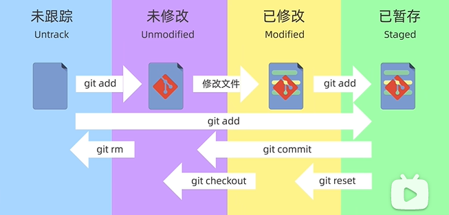
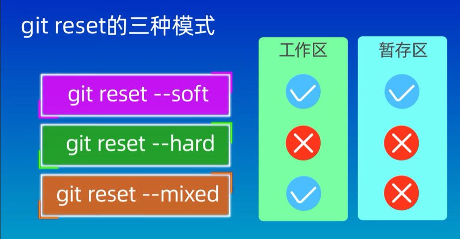
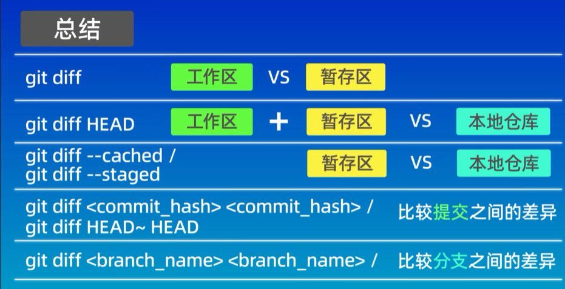
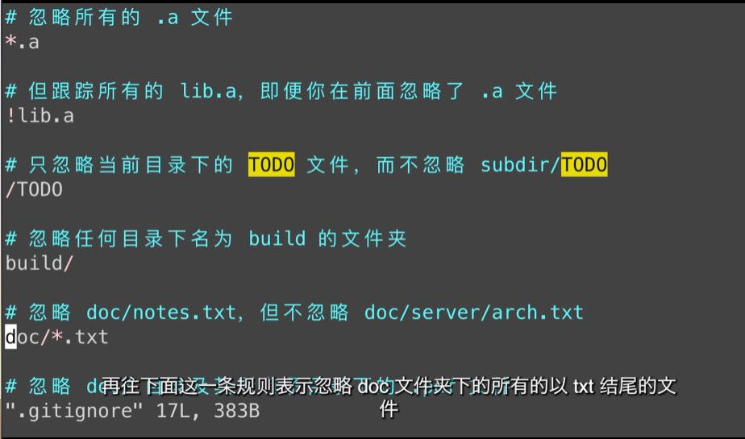
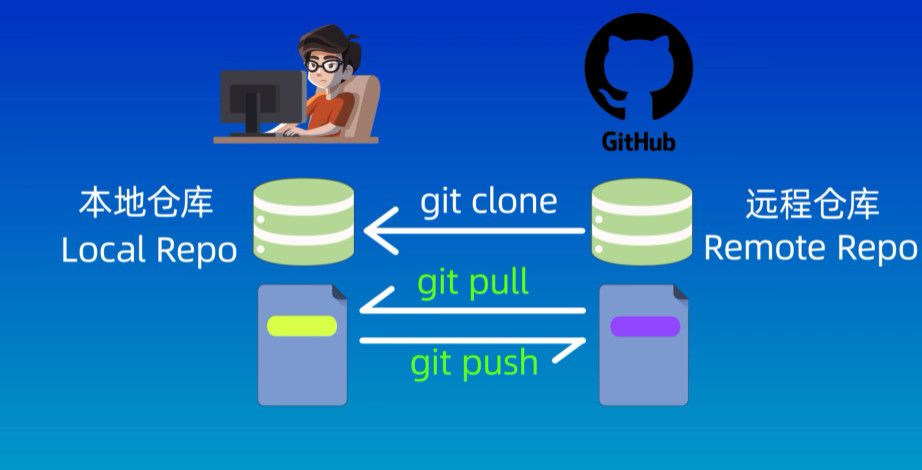
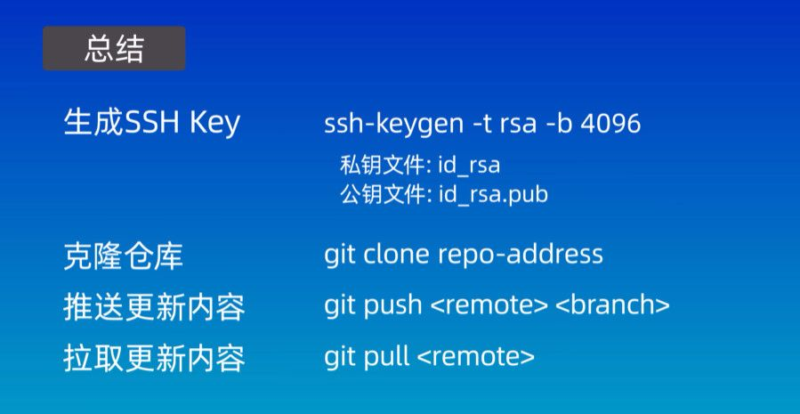
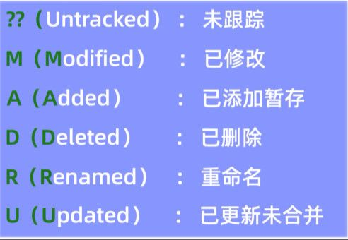
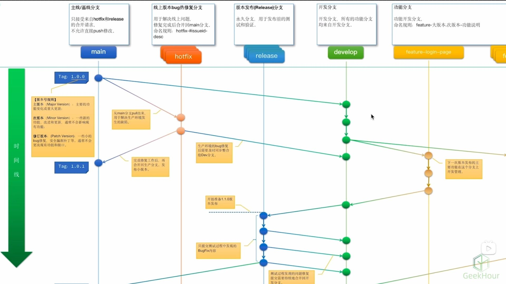

---
# 文档基本信息
title: 快速入门Git
date: 2025-1-1-    # 创建日期，格式：YYYY-MM-DD
author: YuMeng    # 作者（可选）

# 分类和标签
category: 技术文档  # 主分类，只能有一个
tags: 
  - 笔记   # 标签列表，可以有多个
  - 教程   
  - 开发工具
# 文档描述
description: 快速入门Git

# 额外信息（可选）
# image: /path/to/cover.jpg  # 封面图片
# sticky: 0                  # 置顶顺序，数字越大越靠前
# star: false  
---
<ReadingProgress/>

# Git命令

初始化仓库：`git init <project>`

显示所以文件：`ls -a`

> **.git目录**存放了Git仓库的所以数据

查看.git目录:

- ​	`cd .git`
	 ​	`ls -altr`

删除.git目录：`\rm -rf .git`

克隆仓库：`git clone url`

#### 文件状态：

- 未跟踪（Untrack）：指新创建的文件，还未被Git管理起来的
- 未修改（Unmodified）：指已经被Git管理，但文件内容未发生变化
- 已修改（Modified）：指文件内容发生变化，但是还没有添加至暂存区
- 已暂存（Staged）：指文件修改后并且已经添加至暂存区的文件

- `git init` 创建仓库

- `git status` 查看仓库状态

  （查看当前仓库处于哪个分支，有哪些文件及其文件当前处于什么状态）

- `git add` 添加到暂存区

- `git commit` 提交

  （`git commit -m "提交信息"`  **-m参数来指定提交的信息**）

  **提交文件时只会提交暂存区的文件，而不会提交工作区的文件**

创建文件及内容：`echo "这是文件的内容" >  file.txt`

查看文件内容：`cat file.txt`

> Untracked files指未被跟踪的文件

把添加到暂存区的文件取消暂存：`git rm --cached file`

修改文件名称：`mv OldFileName NewFileName`

把所有**以txt结尾的文件**添加到暂存区：`git add *.txt`

添加**所有文件**到暂存区：`git  add .`

> 在vim编辑器中使用 `i` 键进入编辑模式，`wq`键保存并且退出

提交记录：`git log`

> git后可以加入参数，如`git log --oneline`查看简洁的提交记录

回退版本：`git reset`

查看暂存区内容：`git ls-files`

回退到上一个版本：`git reset --hard HEAD^`

> 当前命令指 回退到上一个版本时，工作区和暂存区的文件都会清除
>
> head加一个尖角号表示上一个版本

> 查看操作历史：`git reflog`
>
> 如果误操作可以使用`git reset --hard 版本号`回退到这个版本即可

 查看文件差异：`git diff`

- 查看工作区，暂存区，本地仓库之间的差异
- 查看不同版本之间的差异
- 查看不同分支之间的差异

直接使用git diff命令会默认比较工作区和暂存区之间的差异内容，会显示发生更改的文件以及更改的详细信息（有误）

使用vim修改文件内容：`vi <fileName>`

> vi命令用于打开或者新建文件，并将光标置于第一行

`git diff` **命令显示工作区中已修改但尚未添加到暂存区的文件的差异**

`git diff HEAD` 用来查看当前工作区与**最新提交（HEAD）**之间的差异

比较暂存区和版本库的差异：`git diff --cached`

比较特定版本差异：`git diff <提交ID> <提交ID>`

**`head`**表示当前分支的最新提交（它指向分支的最新节点）*

常用到比较当前版本和上一个版本之间的差异**简便方式**：`git diff head~ head`

**`head~`**表示上一个版本

`git diff head~2 head`表示head之前的第二个版本**？**

> 后面还可以加上文件名，这样就只会查看这个文件的差异内容了

查看分支之间差异：`git diff <branchName> <branchName>`

> 图片有误

删除文件命令：`rm <fileName>`

查看暂存区内容：`git ls-files`

从工作区和暂存区中删除文件：`git rm <fileName>`

把文件暂存区中删除，保留工作区：`git rm --cached <fileName>`

递归删除某个目录下的所有子目录和文件：`git rm -r*`

#### .gitignore

忽略文件：让我们忽略一些不应该被加入到版本库中的文件

忽略文件项：

- 系统或者软件自动生成的文件
- 编译产生的中间文件和结果文件
- 运行时生成日志文件，缓存文件，零时文件
- 涉及铭感信息的文件，密码，口令，秘钥等

`echo <fileName>  >  .gitignore`

`*.log`匹配所有以log结尾的文件

两个`>>` 追加内容：`echo "内容" >>  <fileName>` 

查看状态的简略模式：`git status -s`

> 第一列表示暂存区状态，第二列表示工作区状态
>
> 如果要在.gitignore中忽略某个文件夹，注意文件夹是以斜线结尾的 `temp/`
>
> 

#### github/gitignore

在GitHub中提供了各种常用的忽略问价模板

#### 远程仓库

##### 	配置SSH密钥

回到用户根目录，进入.ssh目录

使用`ssh-keygen`生成密钥

`-t rsa`表示协议为rsa

`-b 4096`指定生成大小

`ssh-keygen -t rsa -b 4096`

如果第一次使用这个命令直接回车就好，它会在我们用户根目录下生成一个id_rsa的密钥文件

如果之前配置过了ssh密钥，最好不要回车，因为之前生成过了密钥文件，如果再次回车会覆盖文件，且不可逆

> 生成文件中没有扩展名的就是私钥文件，以.pub的文件就是公钥文件

如果是第一次创建密钥，且创建密钥的时候没有修改过默认文件，配置ssh就到此

如果指定了一个新的文件名，还需要增加一不配置，创建一个config文件

意思：当我们访问GitHub时，指定使用SSH下的test密钥

使用`vi config` 写入即可

推送：git push

拉取：git pull

 

#### 关联本地仓库和远程仓库

`git remote add <shortname>  <url>`添加远程仓库

`git remote -v`查看当前仓库对应的远程仓库的别名和地址

`git branch -m <main>`指定分支的名称为main

 `git push -u origin <main>`将本地main分支和远程origin仓库的main分支关联起来

> 如果本地分支的名称与远程分支的名称相同的话，省略只写一个main即可

`git pull <远程仓库名> <远程分支名>:<本地分支名>`拉取远程仓库的修改的内容

#### 分支

`code .`使用vscode打开当前目录

创建新分支`git branch <name>`

查看所有分支`git branch`

切换分支`git checkout <name>`

> 存在且在问题，git checkout命令还可以用来恢复文件或者目录到之前的某一个状态
>
> 比如意外修改了某个文件，可以使用git checkout 命令来恢复到我们之前修改前的状态
>
> 但是，如果分支名称和文件名称相同的话就会产生歧义，会默认切换分支，而不是恢复文件

新命令切换文件：`git switch <name>`

将不同分支合并到当前分支中：`git merge <将要合并的分支>`

查看分支图：`git log --graph --oneline --decorate --all`

删除分支：`git branch -d <name>`

> -d参数表示删除**已经完成合并**的分支
>
> 否则使用-D强制删除分支

#### 解决合并冲突

>  指同时修改两个分支的同一个文件，git不知道该保存哪一个

解决方法：手动编辑，留下想要内容，然后再重新提交

在提交之前中断合并`git merge --abort`(当不想继续执行操作时可以使用命令来中止合并操作)

恢复指定时间点的状态`git checkout -b  <dev>  <id>`

创建一个新分支并切换到该分支`git checkout -b <name>`

查看提交ID`git log --graph --oneline --decorate --all`

定义命令别名：`alias <别名> = "命令"`

 变基分支：`git rebase <目标分支>`

Merge

优点：不会破坏原分支的提交历史，方便回溯和查看

缺点：会产生额外的提交节点，分支图复杂

Rebase

优点：不会新增额外的提交记录，形成线性历史，比较直观和干净

缺点：会改变提交历史，改变了当前分支branch out的节点，**避免在共享分支使用此命令**

#### 分支管理和工作流

GitFlow模型

## 评论
<Giscus />