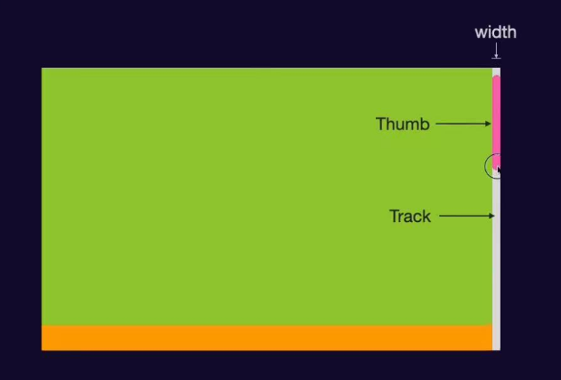

---
# 文档基本信息
title: 前端杂谈
date: 2025-02-16-    # 创建日期
author: YuMeng    # 作者

# 分类和标签
category: 学习笔记  # 主分类
tags: 
  - 其他
  - 笔记

# 文档描述
description: 了解一些零碎的前端知识

# 额外信息
sticky: 0        # 置顶顺序（0表示不置顶）
star: false           # 是否标星
---

<ReadingProgress/>

# 前端杂谈

了解一些零碎的前端知识

## 自定义滚动条



```css

::-webkit-scrollbar{
  width: 10px;
}
::-webkit-scrollbar-track{
  background-color: var(--vp-c-bg);
}
::-webkit-scrollbar-thumb{
  background-color:var(--vp-c-indigo-1);
  border-radius: 10px;
}
::-webkit-scrollbar-thumb:hover{
  background-color: var(--vp-c-purple-3);
}

```